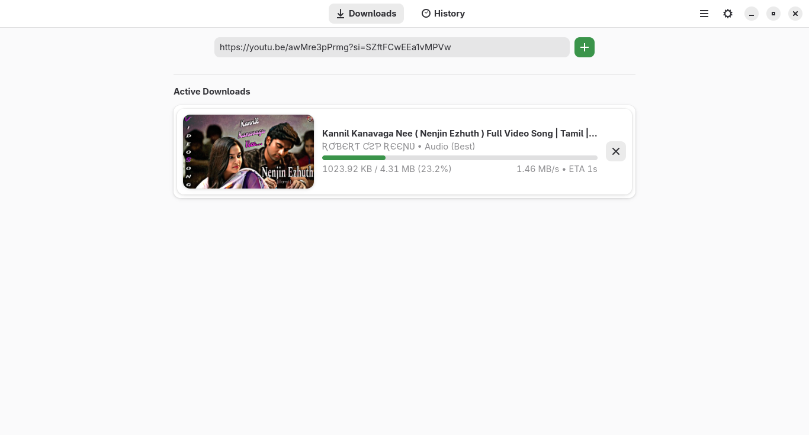
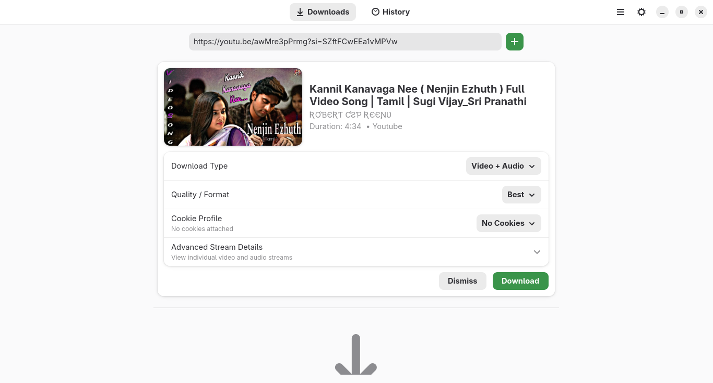
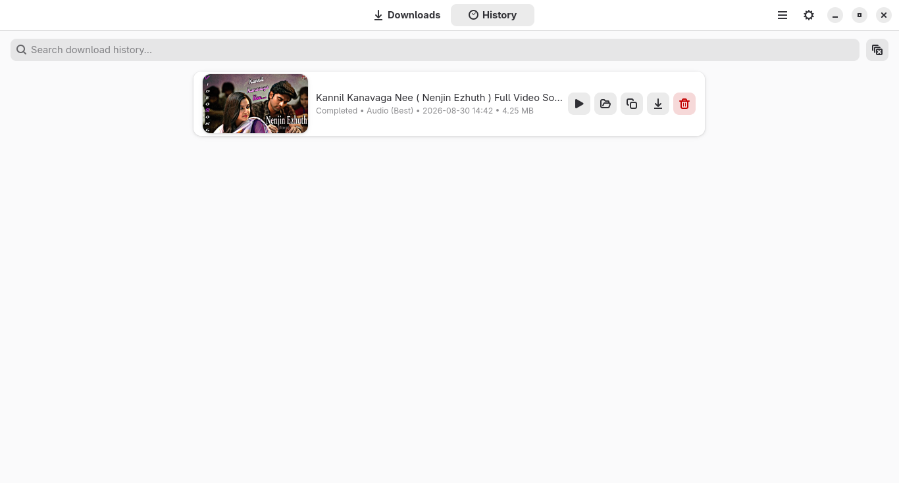
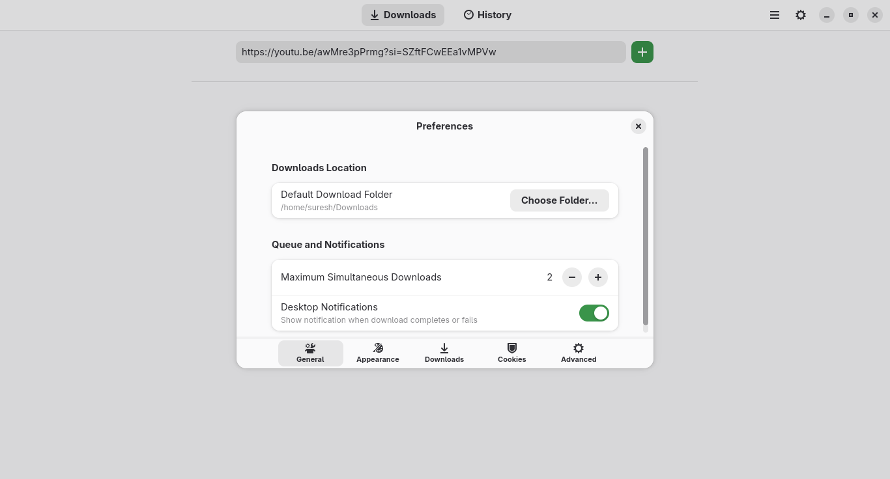

# Glypdl

<div align="center">
  
  <h3>A lightweight, native Linux desktop download manager for yt-dlp</h3>
  <p>Built with <b>GTK4</b> and <b>libadwaita</b> conforming to modern GNOME Human Interface Guidelines.</p>

  <p>
    <a href="https://github.com/sureshsoudararajan/Glypdl/releases"></a>
    <a href="LICENSE"></a>
    
    
    
  </p>
</div>

---

## 📸 Screenshots

<div align="center">
  <table>
    <tr>
      <td align="center"><b>Active Downloads Queue</b><br/></td>
      <td align="center"><b>Metadata & Format Selection</b><br/></td>
    </tr>
    <tr>
      <td align="center"><b>Persistent Download History</b><br/></td>
      <td align="center"><b>Preferences & Settings</b><br/></td>
    </tr>
  </table>
</div>

---

## 🌟 Features

* **⚡ Ultra-Lightweight & Native GTK4 / Libadwaita**:
  * Pure native performance with near-instant launch times and minimal memory footprint &mdash; zero Electron or web wrappers.
  * Adaptive layout following GNOME Human Interface Guidelines (HIG).
  * Seamless theme integration supporting **System**, **Light**, and **Dark** modes.
  * Cross-desktop compatibility across **GNOME**, **KDE Plasma**, **Cinnamon**, **XFCE**, **MATE**, **COSMIC**, and tiling window managers (**Hyprland**, **i3**, **Sway**).

* **🎬 Flexible Download Modes & Quality Selection**:
  * **Video + Audio**: Automatically downloads and merges high-definition video and audio streams using `ffmpeg`.
  * **Video Only**: Download video streams without audio across all standard resolutions (**4K 2160p**, **1440p**, **1080p**, **720p**, **480p**, **360p**, **240p**, **144p**).
  * **Audio Only**: Extract and convert audio directly to **MP3**, **M4A**, **Opus**, **FLAC**, or **WAV** with maximum audio quality.

* **📑 Interactive YouTube Playlist Support**:
  * Automatically detects playlists and fetches video titles, thumbnails, durations, and channels in a scrollable preview card.
  * Individual per-video selection checkboxes to download only the tracks you want.
  * One-click **Select All** / **Deselect All** toggle with a live selection counter (*e.g., 8 of 12 selected*).
  * Batch format selector applying quality settings across all selected playlist items simultaneously.

* **📊 Real-Time Network & Progress Metrics**:
  * Live download speed (*e.g., 9.7 MB/s*), estimated time remaining (ETA), downloaded bytes, and total file size.
  * Dynamic status badges: `Queued`, `Downloading`, `Processing`, `Merging`, `Completed`, `Failed`, and `Cancelled`.
  * Non-blocking multithreaded architecture keeping the GTK UI smooth and responsive at all times.

* **⚙️ Built-In Zero-Click Engine Provisioning**:
  * **Bundled `yt-dlp`**: Every package bundles the latest standalone official `yt-dlp` binary isolated in `/usr/share/glypdl/bin/` so you always have the latest engine without package conflicts.
  * **Auto-Provisioning FFmpeg**: If `ffmpeg` is missing on your host OS, Glypdl automatically downloads a static standalone binary in the background to `~/.local/share/glypdl/bin/`.

* **🔒 Cookie Profiles & Authentication Handling**:
  * **Saved Profiles**: Save and name multiple Netscape `cookies.txt` files (*e.g., YouTube, Patreon, Vimeo*) in Preferences with one-click **Use Profile** switching and active status badges.
  * **Interactive Authentication Recovery**: If a private, age-restricted, or bot-protected link fails, Glypdl automatically displays an **Authentication / Cookies Required** dialog allowing immediate cookie profile selection and retry.

* **📜 Persistent SQLite History**:
  * Local SQLite database recording every download, timestamp, media format, URL, cached thumbnail, and exact disk file size.
  * Instant search filtering by video title or URL.
  * Context actions: **Open File**, **Open Containing Folder**, **Download Again**, **Copy URL**, and **Delete**.
  * One-click **Clear All History** with confirmation.

---

## 📥 Installation

Choose the package format best suited for your Linux distribution:

### 1. 🚀 Universal Standalone AppImage (Works on all Linux distros)
Download the standalone AppImage, make it executable, and run:

```bash
wget -O Glypdl-x86_64.AppImage https://github.com/sureshsoudararajan/Glypdl/releases/download/v1.0.0/Glypdl-x86_64.AppImage
chmod +x Glypdl-x86_64.AppImage
./Glypdl-x86_64.AppImage
```

---

### 2. 📦 Debian / Ubuntu / Linux Mint / Pop!_OS (`.deb`)
Install via `apt` to automatically resolve dependencies:

```bash
wget -O glypdl.deb https://github.com/sureshsoudararajan/Glypdl/releases/download/v1.0.0/glypdl_1.0.0-1_all.deb
sudo apt install -y ./glypdl.deb
glypdl
```

---

### 3. 📦 Fedora / Rocky Linux / RHEL / AlmaLinux (`.rpm`)
Install via `dnf`:

```bash
wget -O glypdl.rpm https://github.com/sureshsoudararajan/Glypdl/releases/download/v1.0.0/glypdl-1.0.0-1.fc44.noarch.rpm
sudo dnf install -y ./glypdl.rpm
glypdl
```

---

### 4. 📦 Arch Linux / Manjaro / EndeavourOS

#### Method A: Direct Pacman Package Installation (Pre-built)
```bash
wget https://github.com/sureshsoudararajan/Glypdl/releases/download/v1.0.0/glypdl-1.0.0-1-any.pkg.tar.zst
sudo pacman -U ./glypdl-1.0.0-1-any.pkg.tar.zst
glypdl
```

#### Method B: Build from Git with `makepkg`
```bash
git clone https://github.com/sureshsoudararajan/Glypdl.git
cd Glypdl
makepkg -si
```

---

### 5. 🛍️ Flatpak (Sandboxed Container)

#### Build & Install Locally:
```bash
cd Glypdl
flatpak remote-add --if-not-exists flathub https://dl.flathub.org/repo/flathub.flatpakrepo
flatpak install -y flathub org.gnome.Platform//50 org.gnome.Sdk//50

flatpak-builder --user --install --force-clean build-dir packaging/flatpak/io.github.sureshsoudararajan.Glypdl.yaml
flatpak run io.github.sureshsoudararajan.Glypdl
```

---

### 6. 💻 Running Directly from Source (No Installation)

```bash
git clone https://github.com/sureshsoudararajan/Glypdl.git
cd Glypdl

# Run directly
PYTHONPATH=src python3 -m glypdl.app
```

---

## ⌨️ Keyboard Shortcuts

| Shortcut | Action |
| :--- | :--- |
| <kbd>Ctrl</kbd> + <kbd>L</kbd> | Focus URL input field |
| <kbd>Ctrl</kbd> + <kbd>V</kbd> | Paste URL into input field |
| <kbd>Ctrl</kbd> + <kbd>H</kbd> | Switch to Download History view |
| <kbd>Ctrl</kbd> + <kbd>,</kbd> | Open Preferences dialog |
| <kbd>Ctrl</kbd> + <kbd>Q</kbd> | Quit Glypdl |
| <kbd>Escape</kbd> | Dismiss preview card or close modal dialog |

---

## 📁 File & Configuration Paths

Following the **XDG Base Directory Specification**:

* **Configuration**: `~/.config/glypdl/config.ini`
* **Cookie Profiles**: `~/.config/glypdl/profiles.json`
* **History Database**: `~/.local/share/glypdl/history.db`
* **Private Binaries (FFmpeg/yt-dlp)**: `~/.local/share/glypdl/bin/`
* **Thumbnail Cache**: `~/.cache/glypdl/thumbnails/`
* **Default Download Folder**: `~/Downloads`

---

## 🧪 Running Automated Tests

Run the full 24-test automated suite:

```bash
PYTHONPATH=src python3 -m tests
```

---

## 📄 License

This project is licensed under the **GNU General Public License v3.0** &mdash; see the [LICENSE](LICENSE) file for details.
